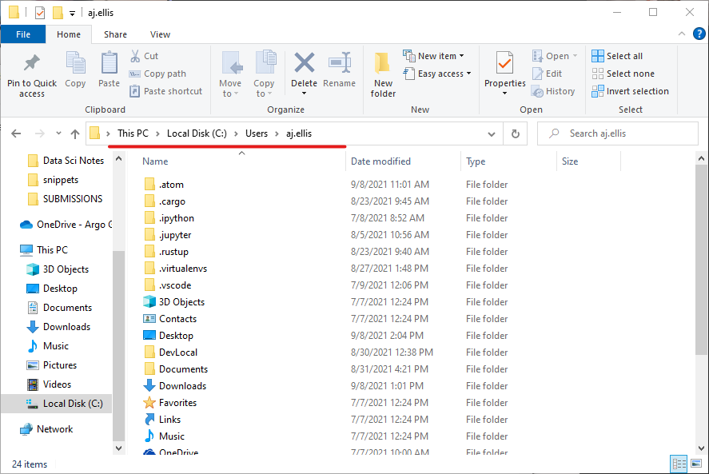
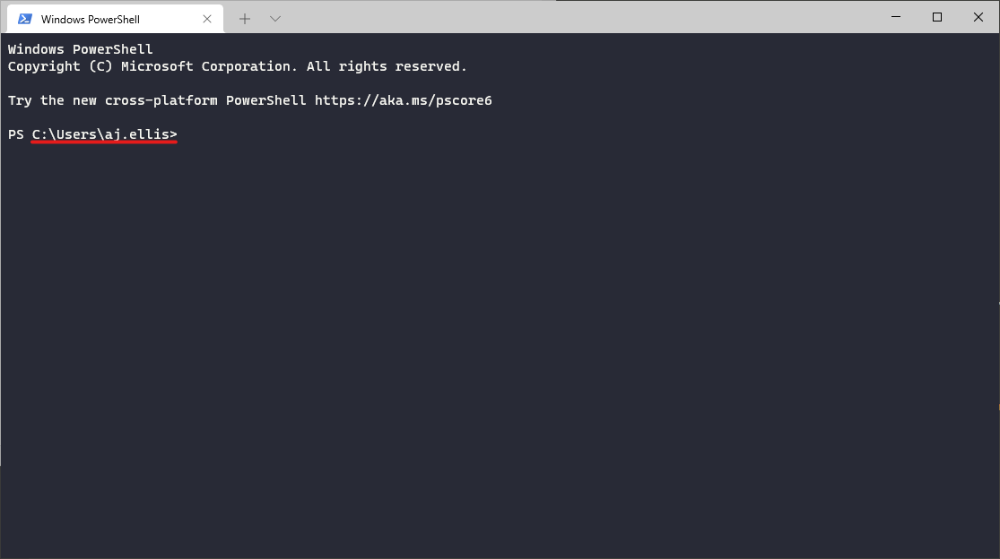

# Getting Started with PowerShell
If you're not used to working with a command line, it can be a bit much to take in. So, let's cover a few basics and see if we can make it more approachable. Once you get a little more familiar / comfortable with working in PowerShell, you might check out the [PowerShell Snippets](useful_powershell_snippets.ps1) in this repo.

## A Few Important Concepts
When you are looking through files on your computer, you are using _Windows Explorer_--that's the name of the program that opens up when you click the folder icon in your taskbar. Using PowerShell is very similar, but you have access to more options and you'll type out your commands instead of using the mouse.

Something helpful to remember is that PowerShell (and most programming-type things in general) uses the word "directory" instead of "folder." They basically mean the same thing, but it helps make sense of terms like **"current working directory."** Speaking of which, let's talk about that.

Just like when you use Explorer, you won't "see" everything in your filesystem. All you'll see is what's in your current working directory. In Explorer, you can find this by looking at the address bar.



In PowerShell, it is displayed as part of the prompt.



In Explorer, you can't click what you can't see. In a loosely similar way in PowerShell, you can't interact with what's not in your current working directory (unless you specify the path through all the folders to get to it). By default, all the commands you run will assume that you want to run them relative to your current working directory. This can come into play with scripting--if you try to run something from a working directory that is different from what a script expects, it can cause problems.

## Common Commands
Let's take a look at some commands: `ls`, `cd`, and `cat`.

```PowerShell
# Lists the contents of your current working directory
ls

# Change to a different directory that you specify (i.e. navigating folders)
cd C:\Users\user.name\Documents

# Change to a directory within your current working directory
# (assuming you're starting from C:\Users\user.name)
cd .\Documents\

# Display the contents of a text file in your PowerShell session
cat 'FileName.txt'
```

`ls` you can remember as an abbreviation for "**l**i**s**t." It will list the contents of your current working directory.

`cd` just means "**c**hange **d**irectory." It basically does the same things as double-clicking a folder icon in Windows Explorer.

`cat` is short for "con**cat**enate." It reads a text file and displays it. This is handy for when you just want to read something quick without opening a separate program.

## Other Useful Things to Know
If you ever need to remember the parameters that are available for a particular command, you can use the `Get-Help` command to look it up. The results can be a little unclear, so you may still need to hit Google to figure things out. However, it can be useful as a reminder for what parameters that the command expects.

```PowerShell
Get-Help New-Item
```

* As you type out filepaths, you can usually hit `Tab` to autocomplete. If multiple autocomplete matches are possible, just hit `Tab` multiple times. If you need to go back to a previous autocomplete option, just use `Shift + Tab`.
* When using Explorer to browse your files, you can `Shift + Right-Click` in an empty space to open a menu with the option to open PowerShell in your current directory.
* If you ever start a script and it gets stuck, you can interrupt the process by using the shortcut `ctrl + c`.

## Aliases
Powershell has some aliases built-in. In fact, you already know some aliases! Remember `ls`? It is actually an alias for `Get-ChildItem`. And remember `cd`? It's an alias for `Set-Location`! Even `cat` is just an alias for `Get-Content`.

This is why, if you run `Get-Help` on the alias for any of these commands, the name that comes back might not be what you expect.
